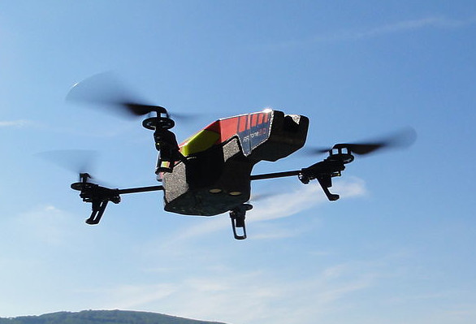
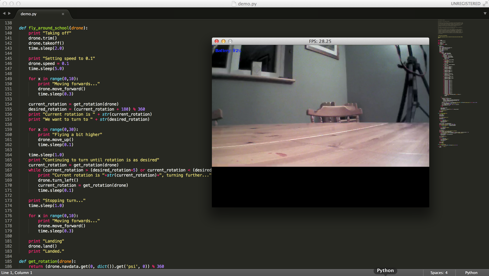

PyXX-Drone
==========

This is not a formal exercise unlike [the others in this half-finished Advanced Python CodeClub curriculum](../../README.md). It's a report on an experimental exercise done in one school. More like a blog post...

Fulbourn Primary School, just east of Cambridge, has been working through the excellent CodeClub Scratch curriculum with several sets of kids for about three terms now - but for the last session before Christmas, we decided to introduce Python - in an unusual way!

It’s quite a jump from drag-and-drop visual Scratch code:

to textual Python code:

I knew the terrific group of year 5s at Fulbourn was absolutely up to the challenge - but I also knew they’d need some motivation to make the switch. Something which Python could do, and Scratch couldn’t.

So, naturally, a flying robot was the way to go.

My employer Bromium not only gives me time to do CodeClub, but buys its employees Christmas presents. Last year they gave me a Parrot AR.Drone 2:

(photo credit Nicolas Halftermeyer, http://en.wikipedia.org/wiki/File:Parrot_AR.Drone_2.JPG)

It turns out there’s a Python API for the AR.Drone, and with a few updates it also worked with the AR.Drone 2 (https://github.com/adetaylor/python-ardrone). Primarily this involved changing the video format from a proprietary Parrot format to HD H.264, using ffmpeg for decoding.

I had prepared a basic script to take off, fly through the school hall, turn 180°, fly back again and land. (https://github.com/adetaylor/python-ardrone/blob/school-demo/libardrone/demo.py#L139). The lesson plan was as follows:

1. Show this script on the big projector in the school hall, alongside the video image from the drone camera
2. Get the kids to talk through what they expect to happen
3. Actually run it!
4. Take requests for improvements and work with the kids on making it happen

Guess what? It turns out that when you mix experimental code, eleven year five kids and a flying robot with four rotating propellors, lesson plans don’t count for much.

The first problem was that the school hall wasn’t available: it had a PE group in it. So, we had to do it in the library. Libraries are known for being full of books and PCs and other drone-destroying obstacles, and this was no exception. It was also much, much smaller than I’d planned for.

The second problem was that I’d failed to find time to actually ever run the script. Oddly enough, it didn’t work first time. Especially the wild guesses about the speeds, heights, distances, etc. involved.

Doomed.

The script code, together with the HD video image from the Drone, displayed beautifully on the projector in the library. But as soon as the drone took off, it flew sideways across the room. For ten minutes this caused me much consternation, and I kept fiddling with the script. Then, I realised, it must be the appalling purple carpet confusing the downward-facing camera, preventing the drone from successfully holding station.

The kids had the bright idea of covering the floor in atlases from the nearest shelf - and it worked! The drone now saw contrast below, and hovered still as it was supposed to, thanks to their suggestion.

So it was time to run the script. Picture the scene. Kids and teachers at one end of the library, clustered round, all agog. Me and the drone at the other end. Would it fly towards them? Would it stop? Would it chop them up into little pieces?

The first few times I had to press the “emergency stop” key I’d put in - space bar to trigger an immediate landing. It turns out that 10 of the 11 kids were very good at running away - Merrick, however, needs to work on it.

Eventually - it flew to the kids and then stopped, and started turning. From then on it was a matter of live-debugging the script on the projector with the kids. A dozen kids clustered round a projector screen suggesting changes to Python - completely unfazed by its unfamiliarity, its textual nature or its great complexity relative to the Scratch they’d been used to.

And you know what? We got it working, as a team. By the end of the hour, it took off, flew to the other end of the room, turned around, flew back and landed! There was much whooping, high-fives all round, and an audience of teachers and cleaners watching to see what all the noise was about. It was awesome.

This term - we’ve gone back to Scratch, on the whole. But a few of the kids are working on some Python exercises. And, most importantly, they all want to. They’ve seen what it can do!

Some notes for anyone else wanting to do the same:
-------

1. I warned the kids in advance that some of them Might Die, or at the very least be horribly maimed. Of course, it’s a safe CE-certified gadget, but scaring the pants off them got them excited and got them to treat a £300 robot with a bit of respect! It didn’t get broken.
2. The teachers were delighted. Their support was important - many schools might have forbidden something like this for health and safety reasons.
3. Kids really like doing selfies in the video camera of a drone connected to a projector showing an HD video image.
4. You can expect to hear “when are you bringing the drone in again?” quite a lot.
5. It was brilliant fun and I think it truly inspired the kids. If you run a CodeClub, it’s the excuse you need to buy an AR.Drone.

Massive thanks to my CodeClub partner Riaan and to the teachers Ms. Eadon and Mr. Goff, and of course to the kids themselves, for an excellent session.
